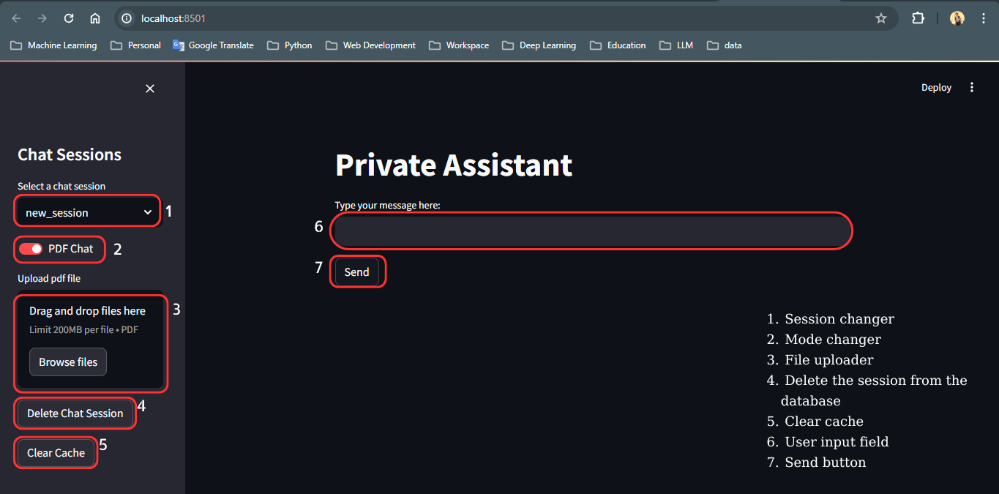

# gpc_rag
## Architecture

A Retrieval Augmented Generation *(RAG)* model serves as a chatbot. It can operate in two modes:

1. ChatGPT Lite
2. Retrieval Mode

In the first mode, the model answers the user's question according to prior knowledge and the chat history. The **LangChain** and an **SQL database** are used to memorize the history. Therefore, the model's responses can be inaccurate. 

In the retrieval mode, the user can upload documents (PDF and Txt) to the server and have the model answer questions. It first extracts relevant information from the uploaded files (stored in vector db). It smooths them with the help of LLM and returns them to the user.

The user can switch between two modes by toggling the button **pdf_chat**.

## How to use this

1. Clone the repo.
2. Install required modules `pip install -r requirements.txt`
3. Launch **Standalone application**
   1. Run the Application `python -m streamlit run app.py`
4. Launch **application with API server**
   1. Launch API server `python api.py`
   2. Launch streamlit UI `python -m streamlit run streamlit_app.py`

## Features

## Frameworks

1.  LangChain
2.  Streamlit
3.  FastAPI

## Citation

[Create your own local ChatGPT for Free, Full Guide: PDF, Image & Audiochat (Langchain, Streamlit)](https://youtu.be/CUjO8b6_ZuM)

[How To Create a Python API with FastAPI](https://youtu.be/lWsGhG6N_1E)

